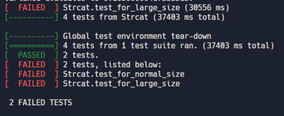

# A more efficient strcat

Write a more efficient strcat which will be effective to concatenate 1000 or more strings.

# solution.c

This file needs to be suitably edited. The goal is to write a more efficient `mystrcat()` function which will help concatenate large number of strings.

The ```mystrcat``` function already has some code and comments (reproduced below). Please read carefully and then modify further as you deem appropriate. 
```c
char *mystrcat (char *target, char *source, int std) { 
    if (std == STDCAT) 
        return strcat(target, source); 
    else {
        return strcat(target, source); 
        // Step 1 
        // comment out the above statement
        // Step 2 
        // Your own custom code for strcat goes below
        //
      
    }
}
```
You can cut-and-paste the above code into your ```solution.c``` file in case you want to "reset" and try again. 

# Test cases to pass



# Incremental Approach

1. It is best to write pointer-rich code so you can eke out as much performance as you can.
2. To begin with, you must attempt to write code that would mimic the string library ```strcat``` function.
3. Modify the code you have from Step 2 to make it more high performant.

Good luck! 

# On Github
- pushed to github